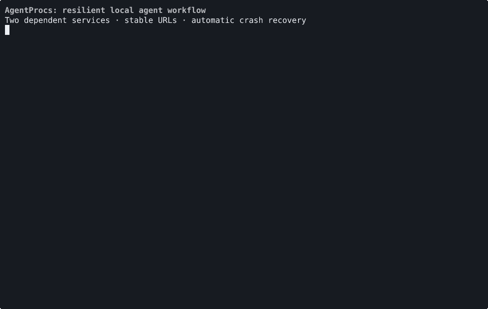
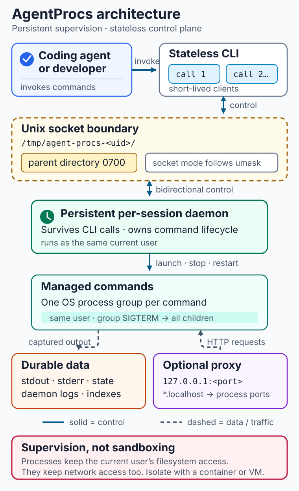

# AgentProcs

Keep development services alive, observable, and controllable across separate AI coding-agent tool calls.

[](https://crates.io/crates/agent-procs) [](https://docs.rs/agent-procs) [](LICENSE) 

Coding agents often start an API, web app, or worker in one shell, then lose the process context on a later tool call. AgentProcs keeps those services under a per-session daemon so the next call can inspect logs, check status, restart a process, or stop everything cleanly.

AgentProcs is for developers using agentic coding workflows on Linux and macOS (Unix only). It provides same-user process supervision, not sandboxing; managed commands retain your filesystem and network access. See [Architecture and security boundary](#architecture-and-security-boundary) for details.

- A daemon persists across CLI calls, with project and session isolation.
- Readiness checks and dependency ordering start services in the right sequence.
- Durable indexed logs and JSON status keep process state available to agents and scripts.
- Restart policies and file watching recover development services; an optional proxy gives them named localhost URLs.

[Quick start](#quick-start) · [Reproduce the demo](docs/demo/README.md) · [Architecture and security](#architecture-and-security-boundary)



This is a real, reproducible local run. Follow [the demo instructions](docs/demo/README.md) to play or record it yourself.

## Install

```
cargo install agent-procs
```

## Quick start

```bash
# Start a process
agent-procs run "npm run dev" --name server

# Auto-restart on crash (up to 5 times)
agent-procs run "npm start" --name api --autorestart on-failure --max-restarts 5

# Restart when source files change
agent-procs run "npm run dev" --name server --watch "src/**"

# Wait for it to be ready
agent-procs wait server --until "Listening on" --timeout 30

# Check output
agent-procs logs server --tail 50

# See what's running
agent-procs status

# Stop it
agent-procs stop server
```

## Config file

Create an `agent-procs.yaml` to manage multiple processes together:

```yaml
session: myproject                          # optional — isolates this project's processes
proxy: true                                 # optional — enables reverse proxy
proxy_port: 9095                            # optional — pin proxy to a specific port

processes:
  db:
    cmd: docker compose up postgres
    ready: "ready to accept connections"
    autorestart: always
    max_restarts: 3
  api:
    cmd: ./start-api-server
    cwd: ./backend
    env:
      DATABASE_URL: postgres://localhost:5432/mydb
    ready: "Listening on :8080"
    port: 8080
    depends_on: [db]
    autorestart: on-failure
    watch:
      - "src/**"
      - "config/*"
    watch_ignore:
      - "*.generated.ts"
```

Processes start in dependency order; independent ones run concurrently.

```bash
agent-procs up                    # start all
agent-procs up --only db,api      # start specific ones
agent-procs down                  # stop all
```

### Field reference

**Per-process fields:**

| Field | Required | Description |
|-------|----------|-------------|
| `cmd` | yes | Shell command to execute |
| `cwd` | no | Working directory (relative to config file location) |
| `env` | no | Environment variables (key: value map) |
| `ready` | no | Stdout pattern that signals the process is ready |
| `depends_on` | no | List of process names that must be ready first |
| `port` | no | Port number — injected as `PORT` and `HOST=127.0.0.1` env vars |
| `autorestart` | no | Restart policy: `always`, `on-failure`, or `never` (default) |
| `max_restarts` | no | Maximum restart attempts (unlimited if omitted) |
| `restart_delay` | no | Delay between crash and restart in ms (default: 1000) |
| `watch` | no | List of glob patterns — restart process when matched files change |
| `watch_ignore` | no | Additional glob patterns to ignore (`.git`, `node_modules`, `target`, `__pycache__` always ignored) |

**Top-level fields:**

| Field | Required | Description |
|-------|----------|-------------|
| `session` | no | Session name (overridden by `--session` CLI flag) |
| `proxy` | no | Enable reverse proxy (default: false) |
| `proxy_port` | no | Pin proxy to a specific port (default: auto-assign from 9090-9190) |

## Reverse proxy

Give processes stable named URLs instead of port numbers. Opt-in via `proxy: true` in config or `--proxy` on the CLI.

```bash
$ agent-procs up
Proxy listening on http://localhost:9090
started api (http://api.localhost:9090)
started web (http://web.localhost:9090)
```

- Processes without an explicit `port` get one auto-assigned (4000-4999 range)
- `PORT` and `HOST=127.0.0.1` are injected into the process env (user env takes precedence)
- Each session gets its own proxy port, so two projects can both have `api` without conflict

Ad-hoc usage without a config file:

```bash
agent-procs run "node server.js" --name api --port 3001 --proxy
# → http://api.localhost:9090
```

## Commands

| Command | Description |
|---------|-------------|
| `run <cmd> [--name N] [--port P] [--proxy] [--autorestart MODE] [--max-restarts N] [--restart-delay MS] [--watch GLOB]... [--watch-ignore GLOB]...` | Spawn a background process |
| `stop <name>` | Stop a process |
| `stop-all` | Stop all processes |
| `restart <name>` | Restart a process |
| `status [--json]` | Show all process statuses |
| `logs <name> [--tail N] [--follow] [--stderr] [--all]` | View process output |
| `wait <name> --until <pattern> [--regex] [--timeout N]` | Wait for output pattern |
| `wait <name> --exit [--timeout N]` | Wait for process to exit |
| `up [--only X,Y] [--config path] [--proxy]` | Start from config file |
| `down` | Stop config-managed processes |
| `session list` | List active sessions |
| `session clean` | Remove stale sessions |
| `ui` | Open terminal UI |
| `completions <shell>` | Generate shell completions (bash, zsh, fish, powershell) |

## Restart policies

Automatically recover from crashes without agent intervention.

```bash
# Restart on non-zero exit, up to 5 times with 2s delay
agent-procs run "npm start" --name api \
  --autorestart on-failure --max-restarts 5 --restart-delay 2000

# Always restart (even clean exits), unlimited attempts
agent-procs run "worker" --name bg --autorestart always
```

| Mode | Behavior |
|------|----------|
| `always` | Restart on any exit |
| `on-failure` | Restart only on non-zero exit |
| `never` | Don't restart (default) |

When `max_restarts` is exhausted, the process enters `Failed` state. Manual `stop` disables auto-restart; `restart` re-enables it and resets the count.

Supervisor annotations (`[agent-procs] Restarted`, `Max restarts exhausted`) are written to disk logs and visible in `logs --tail`, `--follow`, and the TUI.

## File watch mode

Auto-restart processes when source files change.

```bash
agent-procs run "npm run dev" --name server --watch "src/**" --watch "config/*"
```

- Uses OS-native file watching (FSEvents on macOS, inotify on Linux) with 500ms debounce
- `.git`, `node_modules`, `target`, and `__pycache__` are always ignored
- Add `--watch-ignore "*.log"` for additional ignore patterns
- Watch restarts reset the restart count (they're intentional, not crashes)
- File changes can revive a `Failed` process

## Sessions

Use `--session` to isolate process groups (e.g. per-project):

```bash
agent-procs --session projectA run "make serve" --name app
agent-procs --session projectB run "make serve" --name app
agent-procs --session projectA status   # only shows projectA's processes
```

## Architecture and security boundary



Each [Quick start](#quick-start) command is a short-lived CLI client, while a per-session daemon persists across invocations and owns the control plane. CLI requests cross a Unix domain socket whose `0700` parent directory limits access to the current user; the daemon supervises process groups, durable session logs, and the optional [Reverse proxy](#reverse-proxy).

AgentProcs provides process supervision, not sandboxing: managed commands retain the current user's filesystem and network access. Use a container or VM when isolation is required; see [Sessions](#sessions) for operational separation and [SECURITY.md](SECURITY.md) for the complete security model.

## Exit codes

| Code | Meaning |
|------|---------|
| 0 | Success |
| 1 | Error (timeout, connection failure, unexpected response) |
| 2 | No logs found for target process |
